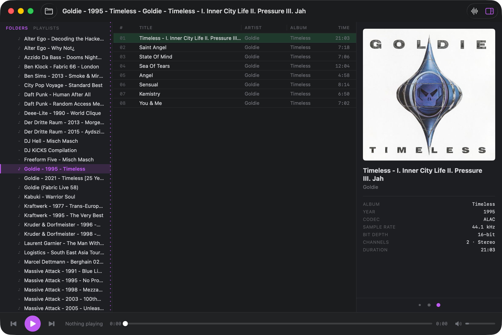
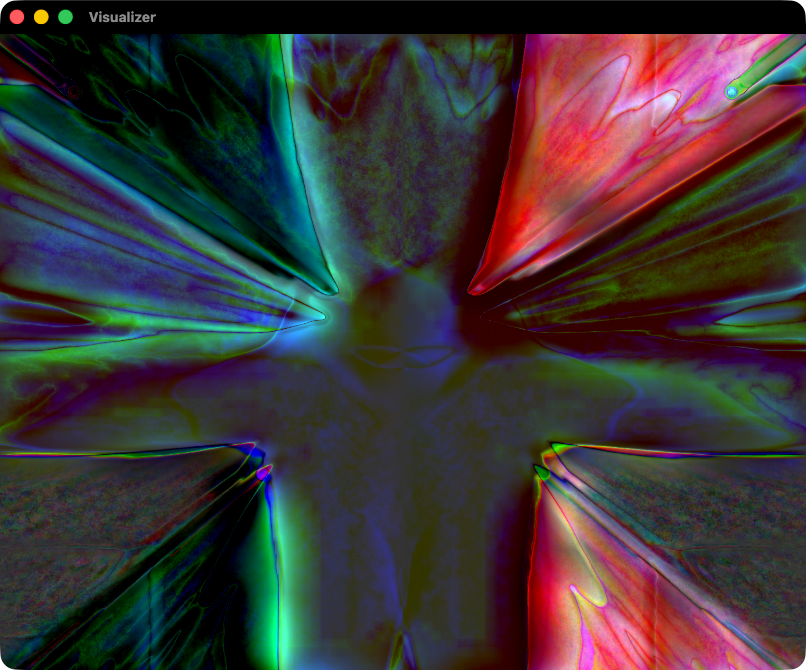

# Konpo

A fast, lightweight music player for macOS, built for people who keep their music
as files in folders — not in a library that wants to "manage" everything for you.

Point Konpo at your music folder and it shows you your folder tree exactly as it
is on disk. Click an album, see its tracks, press play. That's it. It's quiet,
dense, keyboard-friendly, and stays out of your way.

### Why I made it

I'm a big fan of [foobar2000](https://www.foobar2000.org/), but I wanted something
even more minimal — and built around keyboard-focused control from the ground up.
Konpo is that player: you can browse, pick a track, and play without ever reaching
for the mouse.

I also grew up with Winamp, and I always loved its MilkDrop visualizer — so I
brought that back. Konpo's visualizer is powered by
[Butterchurn](https://github.com/jberg/butterchurn), a WebGL reimplementation of
MilkDrop. It's completely optional and stays out of your face: it lives in its own
window, and until you open it, it uses **no memory at all** — nothing spins up
unless you ask for it.

---

## What it does

- **Plays your local files** — ALAC, AAC/M4A, MP3, FLAC, WAV, AIFF, and more.
- **Browses your folders as-is** — your on-disk folder structure *is* the library.
  No importing, no scanning your whole drive, no database to babysit.
- **Gapless playback** — albums mixed to run continuously play with no gap between
  tracks.
- **Album art** — shows embedded artwork, or a `cover.jpg` / `folder.jpg` sitting
  in the album folder. Click the art to open it full-size in its own window.
- **Track details** — album, year, codec, sample rate, bit depth, channels, and
  duration for the selected track.
- **Playlists** — make your own playlists alongside the folder view. Right-click a
  track *or* a whole folder to add it. Playlists are saved automatically.
- **A visualizer** — an optional Winamp/MilkDrop-style visualizer in its own
  window (see below). It only spins up when you open it, so it never slows the app
  down otherwise.
- **Media keys & Control Center** — the play/pause and next/previous keys on your
  keyboard work, and the current track shows up in Control Center and on the lock
  screen.

## Making it yours

- **Accent color** — open Settings (**⌘,**) and pick the highlight color used
  throughout the app.
- **Resize the columns** — drag the thin dividers after the *Title* and *Artist*
  column headers to give long track names more room. The *Album* column gives up
  space so the window doesn't have to grow.
- **Resize the sidebar** — drag the divider between the folder list and the track
  list.
- **Album-art panel size** — three little dots in the top-right of the art panel
  set it to Small, Medium, or Large. Handy if you want a bigger cover or a more
  compact view.

## The visualizer

Open it with the waveform button in the top-right, from the **Window** menu, or
with **⇧⌘V**. It reacts live to whatever's playing.

- It comes with a big pack of built-in presets that cycle automatically.
- **Right-click** inside the visualizer to **Choose Preset Folder…** and point it
  at your own folder of Butterchurn presets, or switch back to **Use Built-in
  Presets**.
- Closing the window frees it completely — with the visualizer closed, Konpo is
  back to being a lean little player.

---

## Keyboard shortcuts

Konpo is built to run entirely from the keyboard — you can browse albums, pick a
track, and start playing without touching the mouse.

### Getting around

| Key | What it does |
| --- | --- |
| **Tab** | Switch focus between the folder list and the track list (a colored edge shows which one the keys are driving) |
| **↑ / ↓** | Move up and down in whichever list is focused |
| **→** | In the folder list: open a folder, or jump over to its tracks |
| **←** | In the folder list: close a folder / go up one · In the track list: jump back to the folders |
| **Return** | Play the selected track |

### Playback

| Key | What it does |
| --- | --- |
| **Space** | Play / pause |
| **⌘→ / ⌘←** | Next / previous track |
| **⌥⌘→ / ⌥⌘←** | Jump forward / back 10 seconds in the current track |

### Windows & view

| Key | What it does |
| --- | --- |
| **⌘B** | Show / hide the album-art panel |
| **⇧⌘V** | Open / close the visualizer |
| **⌘,** | Settings (accent color) |
| **⌘O** | Open a music folder |
| **⌘R** | Refresh the current folder from disk |

Your dedicated media keys (play/pause, next, previous) work too.

---

## Tips

- **First run:** press **⌘O** and choose your top-level music folder. Konpo
  remembers it (and the last album you were on) for next time.
- **Playlists live next to folders:** use the **Folders / Playlists** switch at the
  top of the sidebar. Right-click any track or folder to add it to a playlist, or
  to start a new one.
- **Big collections are fine:** Konpo loads folders lazily, so pointing it at a
  huge music tree stays snappy.
